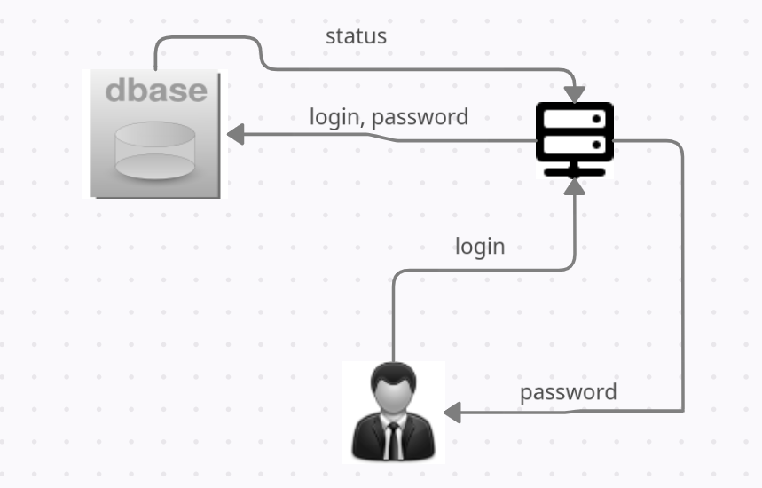
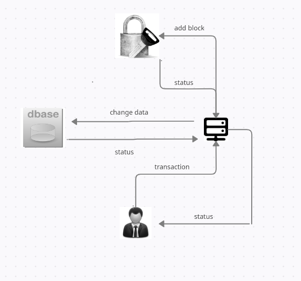

## Курсовой проект на тему исследование блокчейнтехнологий

### Задача, которую я ставил перед собой:
* Исследовать блокчейн технологии по типу создания своей "Криптовалюты".
## Определения:
1. Блокчейн  — выстроенная по определённым правилам непрерывная последовательная **цепочка блоков (связный список),** содержащих информацию. **Связь между блоками обеспечивается не только нумерацией, но и тем, что каждый блок содержит свою собственную хеш-сумму, хеш-сумму предыдущего блока и хеш-сумму транзакции.** **Изменение любой информации в блоке изменит его хеш-сумму.** Чтобы соответствовать правилам построения цепочки, изменения хеш-суммы нужно будет записать в следующий блок, что вызовет изменения уже его собственной хеш-суммы. При этом предыдущие блоки не затрагиваются. Если изменяемый блок последний в цепочке, то внесение изменений может не потребовать существенных усилий. Но если после изменяемого блока уже сформировано продолжение, то изменение может оказаться крайне трудоёмким процессом. Дело в том, что **обычно копии цепочек блоков хранятся на множестве разных компьютеров независимо друг от друга.**
2. Клиент - распоряжается своей криптовалютой как ему хочется (**отправляет её другому пользователю, увеличивает баланс**)
3. Майнер - **обрабатывает каждое действие клиента** у себя на компьютереи **заносит информацию о них в блокчейн в виде блока**. За это он **получает вознаграждение в размере одного токена.**

## Итак, что из этого может следовать:
1.  Блокчейн состоит из цепочки блоков, который содержит в себе информацию о себе, предыдущем блоке и транзакции в виде хеш-суммы.
2.  Децентрализован, т.е. находится сразу на многих компьютерах одновременно.
3. Взломать и изменить эту цепочку блоков парктически невозможно. Т.к. комрьтеры, на которых находится эта цепочка блоков постоянно взаимодействуют между собой, а значит чтобы изменить какой-то из блоков, нужно изменить этот блок и все последущие за ним на всехкомпьютерах.
4. Чтобы создать блок, в котором информация компьютеры брутфорсом подбирают нужную комбинацию хеш-суммы, которая соответсвует определённым условиям. Компьтер, который подобрал эту комбинацию первым - получает токен. Назовём это гонкой за блоком.

В своём курсовом проекте одну из самых главных идиом блокчейна реализовать у меня не получилось, а  именно децентрализацию (У меня существует всего один Майнер, который изанимается всеми процессами в сервисе). НО в замен этого я создал функцию, которая проверяет каждые 5 минут соотвествие блоков. т.е. сравнивает хеши этих функций и в случае их несоотвествия прерывает выплнение с ошибкой.
Так же в силу того, что мой курсовой проект содержит всего одного майнера, никакой гонки за создание блока у меня нету:(

## Иллюстрация возможностей сервиса

###  Регистрация и авторизация
 

###  Транзакция и увеличение баланса

####  P.S. Улучшение проекта
* Чтобы сделать передачу данных защищёнными, необходимо использовать сертификат TSL (Не https). 
  Вот Некоторая информация об этом:
    * https://docs.microsoft.com/ru-ru/dotnet/architecture/grpc-for-wcf-developers/channel-credentials
    * https://github.com/grpc/grpc-go/issues/2164
*  Шифрование ячеек в БД (SQLite3):
    * https://habr.com/ru/post/216739/

